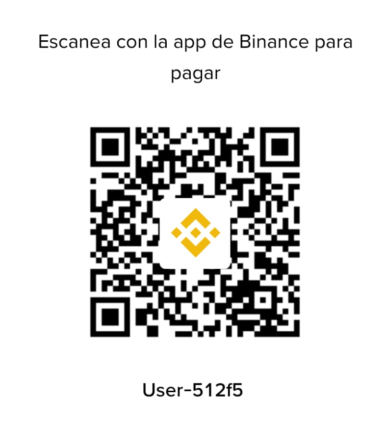

# ChatEN — Traductor de Chat para WoW Ascension

**Autor:** Guidopy
**Estado:** ⚠️ BETA — en fase de prueba

> **Importante:** Esta es una versión de prueba. La traducción **no es exacta** ni perfecta,
> pero te va a hacer mucho más jugable el WoW Ascension al poder entender a los jugadores
> de habla inglesa. Si encontrás errores de traducción, reportalos y se van corrigiendo
> versión a versión.

---

## ¿Qué es esto?

Un addon para **World of Warcraft Ascension** que traduce el chat en tiempo real:

- **Mensajes entrantes (inglés → español):** cuando un jugador de habla inglesa escribe
  en el chat, lo ves traducido al español.
- **Mensajes salientes (español → inglés):** cuando vos escribís en español, tus mensajes
  se traducen al inglés automáticamente para que los demás te entiendan.

Es ideal para servidores con mucha población de habla inglesa: formás grupos, vendés,
comprás y coordinás raids sin barrera de idioma.

---

## ¿Cómo funciona?

El addon captura cada mensaje del chat antes de mostrarlo y lo traduce con un diccionario
local (sin conexión a internet, sin enviar nada a ningún servidor):

1. **Lookup directo:** busca palabras y frases completas en el diccionario bilingüe.
2. **Longest-match:** primero intenta traducir frases enteras ("go final boss" → "vamos
   al jefe final"), y si no encuentra, traduce palabra por palabra.
3. **Stemming y conjugación:** reconoce plurales, gerundios ("buscando"), pasados
   ("compré") y conjugaciones de verbos en español ("podés", "tenés", "querés").
4. **Jerga de juegos:** incluye el vocabulario real de WoW — LFG/LFM ("busco tanque",
   "busco healer"), boss, raid, dungeon, loot, aggro, professions, monturas, etc.
5. **Nombres propios protegidos:** las clases (tanto las custom de Ascension como las
   originales de WoW), nombres de jugadores, links de items/spells y los tokens del
   servidor **nunca se traducen** ni se rompen.
6. **Desambiguación por contexto:** "para" se traduce como "stop" cuando es un pedido
   ("para, necesito"), "does anyone" → "alguien", etc.

Todo corre **localmente en tu máquina**: el diccionario completo se carga al iniciar
(~15 MB de RAM), la traducción es instantánea y no hay latencia.

---

## ¿Qué incluye?

| Componente | Descripción |
|---|---|
| `Core.lua` | Motor del addon: captura de chat, traducción, interfaz, configuración |
| `Data1.lua` … `Data8.lua` | Diccionario bilingüe (~156.000 traducciones) particionado |
| `ChatEN.toc` | Manifesto del addon (versión, interface, archivos) |
| `icon.tga` | Ícono del minimapa |

**El diccionario incluye:**
- Vocabulario general de chat (saludos, preguntas, respuestas, cortesía)
- Vocabulario de juegos: tank, healer, dps, raid, boss, dungeon, loot, buff, debuff, etc.
- Frases típicas de WoW: "lf tank", "inv", "need healer", "wtb", "wtf", "lol", etc.
- Jerga de servidores latinos: "che", "boludo", "vamos a farmear", "aguantá"
- 31 clases protegidas (no se traducen): las 22 custom de Ascension + las 9 del WoW original
- Reorden de adjetivos: "big ogre" → "ogro grande" (y al revés)

---

## Requisitos

- World of Warcraft: **Ascension** (client 3.3.5, Interface 30300)
- Cualquier sistema operativo (Windows, Mac, Linux vía Wine)

---

## Cómo descargar e instalar

### Opción 1: Descargar el ZIP (recomendado)

1. Entrá a la pestaña **Code** de este repositorio y bajá **Download ZIP**.
2. Extraé el ZIP. Dentro vas a ver una carpeta `ChatEN/` (o `ChatEN-main/`).
3. Renombrá la carpeta a `ChatEN` si hace falta (sin el sufijo `-main`).
4. Copiá la carpeta `ChatEN` completa a la carpeta de addons del juego:

   ```
   …/Ascension/Launcher/resources/ascension-live/Interface/AddOns/
   ```

5. Reiniciá el juego (o usá `/reload`).

### Opción 2: Clonar con git

```bash
git clone https://github.com/Guidopy/ChatEN.git
```

Y copiá la carpeta `ChatEN` a tu carpeta de AddOns como en la opción 1.

---

## Uso

El addon traduce automáticamente al cargar:

- **Entrante:** mensajes en inglés → los ves en español.
- **Saliente:** escribís en español → se envía en inglés.

### Comandos

Escribí en el chat:

| Comando | Acción |
|---|---|
| `/chaten` | Activa / desactiva la traducción saliente (tab) |
| `/chaten on` | Activa todo |
| `/chaten off` | Desactiva todo |
| `/chaten log` | Muestra el log de traducciones |
| `/chaten clear` | Limpia el log |
| `/chaten reset` | Resetea la configuración |

También tenés un **ícono en el minimapa** para alternar rápido, y el **menú de canales**
para elegir qué canales traducir (Say, Party, Guild, Trade, Whisper, etc.).

**Frases propias:** podés agregar tus propias frases y traducciones desde la interfaz
(se guardan con prioridad sobre el diccionario).

---

## Solución de problemas

| Problema | Solución |
|---|---|
| No traduce | `/chaten on` — verificá que el canal esté activo en el menú |
| Traducción rara o incorrecta | Es esperable en beta: la traducción no es exacta. Reportalo con la frase exacta |
| Error al cargar | Asegurate de que la carpeta se llama `ChatEN` y que `ChatEN.toc` está dentro |
| No se actualiza | `/reload` o reiniciar el juego |

---

## Contribuir

¿Encontraste una mala traducción? ¿Una frase típica del juego que falta?

1. Abrí un **Issue** con la frase exacta y qué significa.
2. O hacé un **Pull Request** si modificás el diccionario directamente.

Los reportes con frases reales del chat ayudan muchísimo a mejorar la calidad.

---

## Licencia

Este addon es de uso libre y gratuito. No está afiliado ni aprobado por Ascension
o Blizzard Entertainment. World of Warcraft y Ascension son marcas de sus
respectivos propietarios.

---

## ☕ Donaciones

¿Te sirvió el addon? Si querés invitarme algo, escaneá el QR:



¡Gracias por el apoyo! 🙏
